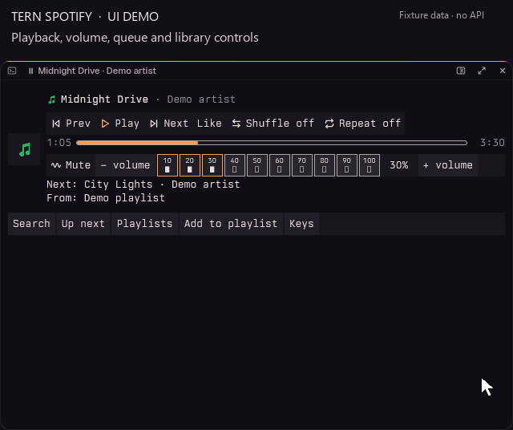

# Spotify for Tern

A floating player for the Windows Spotify desktop app inside [Tern](https://stencil.so/tern):
cover art, accessible playback and a 10-segment volume bar, Like / unlike, Add to playlist,
an upcoming queue, playlist browsing, background lyrics, keyboard shortcuts, search,
and the current track in the status line.
Playback and library browsing use the official Spotify Web API with explicit browser sign-in; lyrics come from LRCLIB.



17-second demo featuring “Bubblegum Bitch” by MARINA, real Spotify artwork and queue, plus a visible cursor and click highlights. Library actions and playlist destinations are simulated; no live Spotify library changes.

## Requirements

- A **Spotify Premium** account for Web API playback control.
- Windows and the Spotify desktop app installed at `%APPDATA%\Spotify\Spotify.exe`.
  Other operating systems and install locations are currently unsupported.
- [Node.js](https://nodejs.org/) **22 or newer**, with global `fetch`.
  The plugin runs `node` from PATH. To use another executable, set `TERN_SPOTIFY_NODE`
  to its full path in the environment that starts Tern.
- Your own [Spotify developer app](https://developer.spotify.com/dashboard) with the Web API enabled
  and exactly **`http://127.0.0.1:8974/callback`** registered as a redirect URI.
  Set `TERN_SPOTIFY_CLIENT_ID` to that app's 32-hex Client ID in the environment that starts Tern.

## Install

Install directly from GitHub:

```powershell
tern plugin install https://github.com/NaC-L/tern-spotify
```

For development, run this inside your local checkout to link it instead of copying it:

```powershell
tern plugin link .
```

Both commands reload Tern's plugins. Run **Spotify: Open player** from the command palette.
The player opens as a picture in picture in the lower-right corner; dock it like any block.
Clicking the Spotify status segment focuses or opens the player.

## Set up Spotify sign-in

Create your developer app with the exact redirect URI above, then set its Client ID before starting Tern.
For example, in PowerShell:

```powershell
$env:TERN_SPOTIFY_CLIENT_ID = "your-32-hex-client-id"
tern
```

This sets the variable for that shell and the Tern process it starts. Restart an already-running Tern
after changing its environment. If your developer app is in development mode, add the Spotify account
you will sign in with to the app's allowed users.
Development-mode apps require their owner to retain Premium and allow at most five authorized users
under Spotify's [current developer restrictions](https://developer.spotify.com/documentation/web-api/tutorials/february-2026-migration-guide).

Open the player and choose **Sign in** to authorize playback and library access in your browser.
Play/pause in a signed-out player also begins sign-in. Complete the browser flow and return to Tern.
**Open** (or `o`) opens the ordinary Spotify desktop app without restarting it or adding debug flags.
Merely loading the plugin starts its bridge, not Spotify or the browser.
If you authorized an older version, choose **Sign in** again to grant the new scopes:
`user-library-read`, `user-library-modify`, `playlist-modify-public`, and
`playlist-modify-private` (as well as playlist-read permissions for browsing).

Authorization uses OAuth with PKCE; **no client secret or DevTools port is needed**.
`token.json` in Tern's plugin data directory holds bearer access and refresh credentials.
Protect that directory from other users and untrusted programs; do not share, publish, or commit it.
To revoke access, remove the app from your Spotify account's authorized apps.

## Controls

The following keys control the player when they are not being used to type a search query:

| Key | Action |
| --- | --- |
| `space`, `k` | Play / pause |
| `left`, `right` | Back / forward 10 seconds |
| `0`-`9` | Jump to 0-90% |
| `n`, `p` | Next / previous track |
| `s`, `r` | Shuffle / cycle repeat (off, all, one) |
| `h` | Like / unlike the current track |
| `a` | Add the current track to a playlist |
| `+`, `-`, `up`, `down` | Spotify volume +/-5% (+/-1% below 10%) |
| `m` | Mute |
| `o` | Open Spotify |
| `/`, `f` | Search |
| `q`, `l`, `?` | Up next / playlists / shortcut help |
| `Tab`, `Shift+Tab`, `Enter` | Choose a control / reverse / activate |
| `Esc` | Close search or a panel without playing |

The Web API has no separate mute operation: mute sets volume to zero and unmute restores the last
remembered volume (50% if the bridge has not observed a previous volume). Devices that cannot
change volume leave these controls unavailable.

Focusing the player leaves playback shortcuts available; open search explicitly with **Search**, `/`, or `f`.
An unfocused floating player retains playback and volume controls, next-track details, and the playback source.
Unsupported controls are unavailable rather than simulated. Queue information is refreshed on playback
changes and periodically; missing next-track data does not mean the queue has ended.

**Up next** lists upcoming tracks. **Playlists** browses your own and followed playlists, with paging;
selecting one replaces the playback context. **Like** saves the current track to your Spotify library;
**Liked** removes it. The button is unavailable until a fresh snapshot reports its library state.
**Add to playlist** lists only playlists you own or that are collaborative. Selecting a playlist adds
the current track without changing playback; **Added to &lt;title&gt;** appears only after Spotify confirms
the command. A page with no editable playlists still offers paging. Choose **Sign in** again if Spotify
denies library or playlist permissions.
Volume has ten clickable segments (10–100% in 10% steps), a percentage readout, mute, and finer +/-
controls. Filled versus outline marks and backgrounds distinguish selected segments without relying
on color; their small visible numbers name the target volumes. The bar wraps in narrow players.
Buttons have accessible names, larger targets, and visible keyboard focus. **Keys** shows shortcut help.

Search lists tracks, albums, artists and playlists after a brief typing pause, starting at three
characters. `Enter` searches shorter queries too. `up` / `down` select a result; `Enter` or a click
plays it through the Web API, replacing the playback context. `Esc` closes search.
With an empty query, `space` still controls playback; without results, `up` / `down` still change volume.
In Playlists and Add to playlist, `up` / `down` select a playlist and `left` / `right` change pages;
`Enter` plays in Playlists and adds the current track in Add to playlist.

Palette commands: **Spotify: Open player**, **Spotify: Play/Pause**, **Spotify: Next track**,
and **Spotify: Previous track**.

## Background lyrics

While Spotify reports actual playback and its snapshot is fresh, available lyrics fill the space
below the player header in both the unfocused floating preview and the normal docked/focused view.
Controls and search keep their own space, without overlapping the non-interactive lyrics.

For synced lyrics, the current line uses readable, bold sans-serif text; adjacent lines are smaller
and muted. Long current lines wrap, while adjacent lines truncate to fit compact cards.
Selection follows the player's extrapolated position, including seeks; before the first timestamp
there is no highlighted line. Empty lines and instrumental markers are preserved, so an intentional
gap does not keep showing the previous lyric. Unsynced lyrics show up to the first three lines as
static, dim text, without invented timing.

Lyrics come from [LRCLIB](https://lrclib.net/), not a Spotify private endpoint. Requests send the
track title, artist, album when available, and rounded duration when supported to LRCLIB.
Matches and timing may differ from Spotify's lyrics. Tracks without lyrics, request errors,
and unsupported responses leave the ordinary player intact. Lyrics requests time out after ten
seconds independently of playback requests.
The background hides when paused, disconnected, or stale, and clears on track changes. Each track
transition fetches once; failures are not retried until another transition or reconnection. The plugin
checks for a matching result at most twice per second, then caches it, including absence/error results.

## Internals and troubleshooting

`bridge/bridge.js` runs in Node and calls the official Spotify Web API.
Playback state is polled every **2 seconds**, with a refresh after playback commands; the UI
extrapolates the position between snapshots. Spotify rate limits pause API requests for the
server's `Retry-After` interval. Short limits retain the last state; longer limits show a problem.
The bridge exits after the plugin's check-in is 30 seconds old. The reference file protocol is
preserved in Tern's plugin data directory:

- `now.json`: version-1 snapshot, heartbeat, actual control capabilities, command reply, and `track.id` (Spotify URI).
  Optional `liked: boolean` is the current track's library state; it is absent while unknown/unavailable.
  `reply: {id,error?}` acknowledges the command id; a reply without `error` means success.
- `inbox/<id>.cmd`: one `<op> <arg>` command; stale commands older than 10 seconds are discarded.
  Commands: `toggle`, `next`, `prev`, `seek <ms>`, `shuffle on|off`, `repeat off|all|one`,
  `volume <0-100>`, `mute on|off`, `play <track|album|artist|playlist> <URI>`, `search <query>`,
  `playlists <offset>`, `like on|off <itemURI>`, `add <playlistURI> <itemURI>`, `launch`, `login`.
  Library item URIs match `^spotify:(track|episode):[A-Za-z0-9]+$`; playlist URIs match
  `^spotify:playlist:[A-Za-z0-9]+$`.
- `alive`: plugin check-in timestamp in Unix seconds.
- `search.json`: search command id, query, and results or an error.
- `playlists.json`: playlist command id, page offset, results and next offset, or an error.
  Each item has `{kind,id,title,detail,editable?}`; `editable: true` means owned by the signed-in user
  or collaborative. Add to playlist includes only items explicitly marked editable.
- `lyrics.json`: atomically replaced version-1 lyrics result, matched by track URI (see below).
- `bridge.log`: bridge diagnostics.
- `token.json`: client ID, bearer access token, refresh token, and expiry; keep this private.

The protocol is documented in `src/link.luau`. `tern plugin list` reports plugin load problems.
If the bridge fails to start, check Node's version/PATH, `TERN_SPOTIFY_NODE`, and
`TERN_SPOTIFY_CLIENT_ID`. For sign-in errors, check the exact redirect URI, allowed users, and
whether another process occupies callback port 8974. For playback errors, confirm Premium and
open Spotify so a playback device is available. Expired or revoked authorization requires **Sign in** again.

`lyrics.json` has the shape
`{v:1,id,status:"ok"|"none"|"error",synced,lines:[{t,text}],error?}`.
`id` is the current track's Spotify URI; `id:""` with `status:"none"` invalidates previous
lyrics during a track change, absence, or disconnect. There is no pending status: the reader waits
for a terminal result matching `now.json`'s `track.id`. `status:"ok"` has a nonempty lines array;
`none` and `error` have `synced:false` and an empty array, with a diagnostic `error` string for
errors. `t` is integer milliseconds in the range 0–86,400,000, including for unsynced data where it
is not used for selection. Synced timestamps must be nondecreasing; at a shared timestamp the last
line is active. Text, including empty strings, is preserved. Responses are limited to 512 lines,
2,048 UTF-8 bytes per line, and 256 KiB of combined text. Invalid/oversized responses become
error results rather than truncated lyrics. The Luau reader validates the protocol and track match.
If an atomic file replacement fails (for example, a Windows reader holds the destination), the
bridge retains the result and retries writing on publication/heartbeat without another request.

Local migration checks with Node **22.20.0** exercised the actual bridge process and file consumer:
PKCE callback state/replay rejection, token persistence/refresh/rotation, 401 recovery, 403 errors,
204/no-item/episode playback, progress without refresh latency, controls/search, and Spotify/LRCLIB
rate-limit cooldowns. Spotify responses were mocked; a live LRCLIB lookup returned synced lyrics.
An isolated real Tern instance rendered sign-in, empty playback, track/lyrics and focused search;
keyboard actions wrote the expected `login` and `toggle` commands. Live Spotify authorization and
playback remain unverified until a real Client ID is configured and sign-in completes.

UI/library checks exercised an isolated installed Tern window with fixture snapshots: pointer volume
commands, named screen-reader buttons, Tab/Shift+Tab/Enter, playback shortcuts, queue display,
playlist paging/selection, permission errors and dismissal before late results. Narrow 468×358 and
wide 720×420 players were inspected, including actual light and dark appearances. Node bridge
checks used mocked Spotify responses for pagination, invalid offsets, 403 guidance, stale responses,
empty queues and queue refresh; existing search and volume commands remained functional.

## 0.2.0 changes

- Added named playback controls, pointer volume adjustment, shortcut help, queue and paginated playlists.
- Added Like / unlike (`h`), Add to playlist (`a`), and a wrapping 10-segment volume bar.
- Player focus no longer automatically opens search or captures playback shortcut letters.
- Migrated playback and search from desktop DevTools control to the official Spotify Web API.
- Added explicit PKCE browser sign-in, `TERN_SPOTIFY_CLIENT_ID`, and private token persistence.
- Replaced Spotify-private lyrics requests with LRCLIB while retaining the lyrics UI and file protocol.
- Opening Spotify no longer requires debug flags or restarts the app.

## Attribution

Ported from [H4vC/tern-CDP-tidal](https://github.com/H4vC/tern-CDP-tidal), retaining its Luau player,
search, floating preview, status segment, and file-command protocol. `icons/spotify.svg` is an original,
generic music-note icon, not an official Spotify logo. This is an unofficial plugin, not affiliated
with Spotify.

The upstream repository has no license file. This adaptation is published with the author's
permission; no blanket redistribution license for the upstream-derived code is implied.
